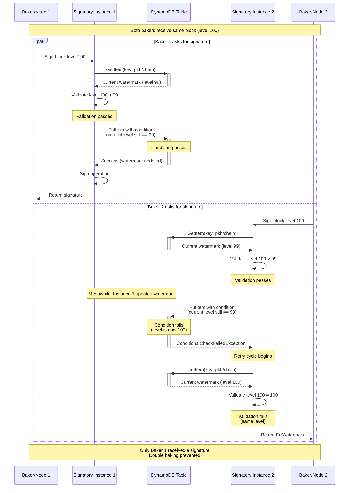

# AWS DynamoDB Watermark Backend

The AWS DynamoDB watermark backend provides a robust, distributed solution for watermark tracking in Signatory. This backend is particularly valuable for high-availability setups and production environments where reliability is critical.

> For a general introduction to watermarks and why they're important, see the [Watermarks Overview](watermarks.md).

## Why Use AWS DynamoDB for Watermarks?

AWS DynamoDB offers several benefits as a watermark backend:

1. **High Availability**: DynamoDB is a fully managed, highly available database service with built-in redundancy.

2. **Concurrency Support**: DynamoDB provides strong consistency for reads and conditional writes, ensuring accurate watermark tracking across multiple Signatory instances.

3. **Scalability**: DynamoDB can handle any volume of watermark tracking data with predictable performance.

4. **Cloud-Native Integration**: If you're already using AWS services, DynamoDB integrates seamlessly with your infrastructure.

5. **Reliability**: DynamoDB offers global tables, point-in-time recovery, and backup options to protect your watermark data.

## Configuration

Below is the minimum configuration required to use DynamoDB as a watermark backend:

```yaml
watermark:
  driver: aws
  config:
    access_key_id: <aws_access_key_id>
    secret_access_key: <aws_secret_access_key>
    region: <aws_region>
```

When the backend is initialized, it will create a table named `watermark` if it doesn't exist.

## Configuration Parameters

| Name              | Type   | Required | Description                                                         |
|-------------------|--------|:--------:|---------------------------------------------------------------------|
| access_key_id     | string | OPTIONAL | IAM user detail for accessing DynamoDB                              |
| secret_access_key | string | OPTIONAL | IAM user detail for accessing DynamoDB                              |
| region            | string | ✅       | AWS region where the DynamoDB table is located                      |
| table             | string | OPTIONAL | Name of the DynamoDB table to use for watermark tracking (default: `watermark`) |

## Environment Variables Support

The `access_key_id`, `secret_access_key`, and `region` fields can also be set using the following environment variables:

- `AWS_ACCESS_KEY_ID`
- `AWS_SECRET_ACCESS_KEY`
- `AWS_REGION`

The `table` parameter defaults to `watermark` but can be overridden in the configuration file.

## Best Practices for High-Availability Setups

When using DynamoDB for watermarks in a high-availability setup:

1. **Same Table**: Ensure all Signatory instances use the same DynamoDB table.

2. **IAM Permissions**: The IAM user or role needs read and write permissions to the DynamoDB table. Consider using the following minimal IAM policy:

```json
{
  "Version": "2012-10-17",
  "Statement": [
    {
      "Effect": "Allow",
      "Action": [
        "dynamodb:GetItem",
        "dynamodb:PutItem",
        "dynamodb:UpdateItem",
        "dynamodb:DeleteItem",
        "dynamodb:Query",
        "dynamodb:CreateTable"
      ],
      "Resource": "arn:aws:dynamodb:*:*:table/watermark"
    }
  ]
}
```

3. **Region Proximity**: For best performance, use a DynamoDB table in the same region as your Signatory instances.

4. **Monitoring**: Monitor the DynamoDB table's throughput metrics and consider enabling auto-scaling if needed.

5. **Backups**: Enable point-in-time recovery for the DynamoDB table to protect against data loss.

## How DynamoDB Watermarks Work

The DynamoDB backend implements concurrent signing protection through a mechanism of conditional writes:

1. When a signing request arrives, Signatory reads the current watermark from DynamoDB
2. It validates if the operation can be signed based on level and round comparison
3. If valid, it attempts to update the watermark using a conditional write that only succeeds if the stored watermark hasn't changed
4. If another instance has updated the watermark in the meantime, the condition fails, and the process repeats

This mechanism ensures that only one instance can successfully sign and record a watermark for a specific level/round, even when multiple instances try simultaneously.



The diagram above illustrates how the DynamoDB watermark mechanism prevents double signing even when multiple Signatory instances receive signing requests simultaneously, effectively protecting against slashing penalties.

## Troubleshooting

### Common Issues

1. **Access Denied Errors**: Verify your IAM permissions and credentials.

2. **Latency**: If you experience high latency, ensure your DynamoDB table is in the same region as your Signatory instances.

3. **Throttling**: If you receive throttling errors, consider provisioning more read/write capacity for your DynamoDB table or enabling auto-scaling.

### Monitoring

Monitor your DynamoDB table's performance using AWS CloudWatch. Key metrics to watch include:

- ConsumedReadCapacityUnits
- ConsumedWriteCapacityUnits
- ThrottledRequests

## Cost Considerations

DynamoDB charges based on provisioned throughput and storage. For most Signatory deployments, the watermark table requires minimal resources, making it a cost-effective solution. Consider using on-demand pricing for small to medium deployments.