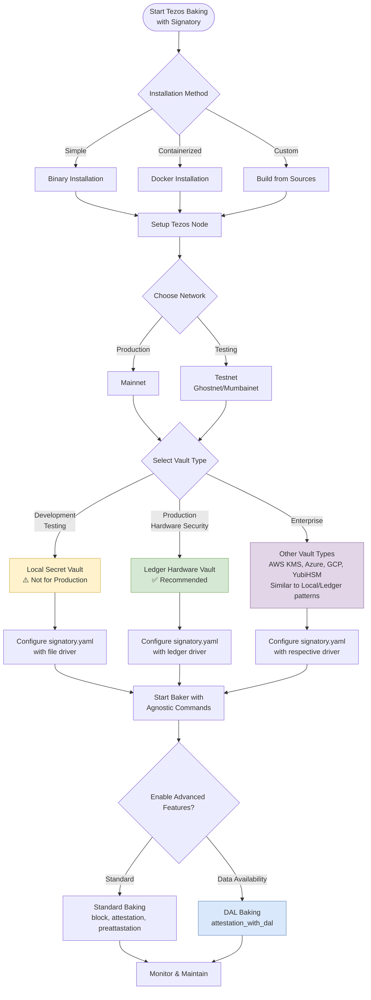

# How to use Signatory with a Tezos Baker

A Tezos node can be installed from binaries, or run with docker, or built from sources (for details see [here](https://teztnets.xyz/)). In each case a baker is set up with a network and a vault. This guide focuses on practical baking configurations using Signatory's two most commonly used vault types, from which other vault configurations can be inferred.



## Bakers on Tezos Networks

Things you will need to know:
- A working octez-client instance
- The host_address for a Tezos Node
    - In this example, we will host a node locally at `http://localhost:8732`
- A public_key_hash to be the baker
    - e.g. `tz1iUqDimrzPmYuWbmLgWwX73YF7dBcaJryU`
- The protocol running on the network used
    - e.g. `PtMumbai`

Verify the node:

```
curl ${host_address}/chains/main/is_bootstrapped
```

List known addresses :

```
./octez-client list known addresses

alice: tz1iUqDimrzPmYuWbmLgWwX73YF7dBcaJryU (unencrypted sk known)

```


Show the baker address and secret key:

```
./octez-client show address -S alice

Hash: tz1iUqDimrzPmYuWbmLgWwX73YF7dBcaJryU
Public Key: edpktmKfj5reMbPmgwh2BNw5EHYpHEZZceMWfffcEpfPTn6pXgoRwF
Secret Key: unencrypted:edsk2hf8Y9oYMQ9MiEAH9pbs3H7tpcBbyxjcWuRjJCrGPB81bDHC7s
```

Ensure minimum required balance for baking rights. To get funds, use the [faucets](https://teztnets.xyz/). This has to wait util bootstrapping is complete.

```
./octez-client get balance for alice
```

Register the implict account as a delegate. We can use a consensus key as well:

```
./octez-client register key alice as delegate

./octez-client register alice as delegate with consensus key bob
```

Check for baking rights. Depending on the network used this can take days. You will need to guess at the cycle parameter.

```bash!
./octez-client rpc get /chains/main/blocks/head/helpers/baking_rights?cycle=<cycle>&delegate=${public_key_hash}

```
To start the baker :
```bash!
./octez-baker-alpha run with local node ~/.tezos-node --liquidity-baking-toggle-vote pass
```

## Agnostic Baker Commands

Signatory provides vault-agnostic commands that work consistently across all supported vault types. These commands provide a unified interface for managing keys and baking operations regardless of the underlying vault implementation.

### Core Agnostic Commands

The `signatory-cli` tool provides several commands that work with any configured vault:

#### Key Management
```bash
# List all available keys across all configured vaults
./signatory-cli list -c signatory.yaml

# Import a key (for vaults that support key import)
./signatory-cli import -c signatory.yaml

# Generate a new key (for vaults that support key generation)
./signatory-cli generate -c signatory.yaml
```

#### Vault-Specific Operations
While the interface is consistent, some commands are vault-specific:

```bash
# Ledger-specific commands
./signatory-cli ledger list -c signatory.yaml
./signatory-cli ledger setup-baking <key_id> -c signatory.yaml
./signatory-cli ledger deauthorize-baking <key_id> -c signatory.yaml

# HSM-specific commands (for YubiHSM and other HSMs)
./signatory-cli hsm list -c signatory.yaml
```

#### Configuration Validation
```bash
# Test vault connectivity and configuration
./signatory-cli list -c signatory.yaml

# Validate configuration file
./signatory serve -c signatory.yaml --dry-run
```

### Standard Baking Operations

Regardless of the vault type, all baking operations use the same HTTP API endpoints:

```bash
# Get public key (works with any vault)
curl localhost:6732/keys/tz1...

# Health check
curl localhost:9583/healthz

# List authorized keys
curl localhost:6732/authorized_keys
```

### High Water Mark Management

Signatory automatically manages high water marks to prevent double signing, but you can also manage them manually:

```bash
# For Ledger devices
./signatory-cli ledger get-high-watermark -d <device_id> -c signatory.yaml
./signatory-cli ledger set-high-watermark <level> -d <device_id> -c signatory.yaml
```

This agnostic approach means you can switch between vault types with minimal changes to your baking infrastructure.

## Baking with DAL (Data Availability Layer)

The Data Availability Layer (DAL) is a feature in Tezos that enhances the network's data availability and scalability. When baking with DAL enabled, bakers can participate in data availability operations in addition to standard block production and attestation.

### What is DAL?

DAL provides a mechanism for publishing data in a way that ensures availability without requiring all nodes to store all data permanently. This is particularly important for scaling solutions and rollups that need to publish data to the Tezos network.

### Configuring DAL Baking

To enable DAL baking, you need to add the `attestation_with_dal` operation to your Signatory configuration:

```yaml
tezos:
  tz1YourBakerAddress:
    log_payloads: true
    allow:
      block:              # Standard block baking
      attestation:        # Standard attestations  
      preattestation:     # Pre-attestations
      attestation_with_dal: # DAL attestations ✨ NEW
      generic:
        - transaction
        - reveal
        - delegation
```

### DAL Node Setup

To participate in DAL, you need to run a DAL node alongside your regular Tezos node:

```bash
# Start DAL node
./octez-dal-node run --data-dir ~/.tezos-dal-node

# Start baker with DAL support
./octez-baker-alpha run with local node ~/.tezos-node \
  --dal-node http://localhost:10732 \
  --liquidity-baking-toggle-vote pass
```

### DAL Operations

When DAL is enabled, Signatory will handle additional operation types:

1. **Standard attestations**: Regular network consensus operations
2. **DAL attestations**: Data availability confirmations
3. **Combined operations**: Operations that include both consensus and DAL data

### Monitoring DAL Baking

Monitor DAL operations in Signatory logs:

```bash
# Look for DAL-specific log entries
INFO[0000] Requesting signing operation    ops="map[attestation_with_dal:1]" request=attestation_with_dal
INFO[0000] Signed attestation_with_dal successfully      request=attestation_with_dal
```

### DAL Configuration Example

Here's a complete configuration example with DAL enabled:

```yaml
server:
  address: :6732
  utility_address: :9583

vaults:
  ledger:
    driver: ledger
    config:
      id: your-ledger-id

tezos:
  tz1YourBakerAddress:
    log_payloads: true
    allow:
      block:
      attestation:
      preattestation: 
      attestation_with_dal:  # Enable DAL attestations
      generic:
        - transaction
        - reveal
        - delegation
```

### Prerequisites for DAL Baking

- Tezos node with DAL support (recent Octez version)
- DAL node running and synchronized
- Sufficient bandwidth for DAL data operations
- Updated Signatory configuration with `attestation_with_dal` permissions

DAL baking is optional and can be enabled incrementally without affecting standard baking operations.

## Signatory

Clone Signatory from its Github repository or run with docker .

```
git clone <https://github.com/daily-co/signatory.git>
```

Build Signatory:

```
cd signatory
make signatory
make signatory-cli
```


### 1. Local Secret
This is not a secure method of key storage, but it is the simplest example.
Create a file `/etc/secret.json` and populate it with the PKH and secret key for the baker:
```json!
[
  {
    "name": "tz1iUqDimrzPmYuWbmLgWwX73YF7dBcaJryU",
    "value": "unencrypted:edsk2hf8Y9oYMQ9MiEAH9pbs3H7tpcBbyxjcWuRjJCrGPB81bDHC7s"
  }
]
```
Create a `local_secret.yaml` file with the following content. 

```
server:
  address: :6732
  utility_address: :9583

vaults:
  local_secret:
    driver: file
    config:
      file: /etc/secret.json
      
  tezos:
    tz1iUqDimrzPmYuWbmLgWwX73YF7dBcaJryU:
      log_payloads: true
      allowed_operations:
      - generic
      - block
      - endorsement
      - preendorsement
      allowed_kinds:
      - reveal
      - delegation
```

Start Signatory :

```
./signatory serve -c ./signatory.yaml
```

Test that Signatory is working :

```bash!
curl localhost:6732/keys/tz1iUqDimrzPmYuWbmLgWwX73YF7dBcaJryU

{"public_key":"edpktmKfj5reMbPmgwh2BNw5EHYpHEZZceMWfffcEpfPTn6pXgoRwF"}


./signatory-cli list -c local_secret.yaml

INFO[0000] Initializing vault                            vault=file vault_name=local_secret
Public Key Hash:    tz1iUqDimrzPmYuWbmLgWwX73YF7dBcaJryU
Vault:              File
ID:                 tz1iUqDimrzPmYuWbmLgWwX73YF7dBcaJryU
Active:             false
```
Import the key Signatory provides into octez-client, overriding the key alice created earlier.

```bash!
./octez-client import secret key alice http://localhost:6732/tz1iUqDimrzPmYuWbmLgWwX73YF7dBcaJryU --force
```
Check the tezos node secret key file:
```bash!
cat ~/.tezos-client/secret_keys
[{ "name": "alice",
    "value": "http://localhost:6732/tz1iUqDimrzPmYuWbmLgWwX73YF7dBcaJryU"
}]
```

Do a tezos transfer operation:
```bash!
./octez-client transfer 10 from alice to bob
```
and check the signatory logs
```go!
INFO[0006] Requesting signing operation                  ops="map[transaction:1]" ops_total=1 pkh=tz1iUqDimrzPmYuWbmLgWwX73YF7dBcaJryU request=generic vault=File vault_name=local_secret
INFO[0006] About to sign raw bytes                       ops="map[transaction:1]" ops_total=1 pkh=tz1iUqDimrzPmYuWbmLgWwX73YF7dBcaJryU raw=034266bedbf77c4e104790c8c3e7ca81cef9aa2f63770ae27d9032c670902f03e76c00fa8d929d0a3eb3a509e16bd6aec74e6c18783432e102fd13e9070080ade20400005cf5b8fb0209b20765b88233de1700896d4d084a00 request=generic vault=File vault_name=local_secret
INFO[0006] Signed generic successfully                   ops="map[transaction:1]" ops_total=1 pkh=tz1iUqDimrzPmYuWbmLgWwX73YF7dBcaJryU request=generic vault=File vault_name=local_secret
```


### 2. Ledger Devices

Make sure that the ledger device is able to work with your linux system and is enabled through udev rules. Some examples can be found [here](https://github.com/LedgerHQ/udev-rules)

Make sure that tezos client can access the ledger:
```bash!
./octez-client list connected ledgers

## Ledger `elated-beaver-unusual-nightingale`
Found a Tezos Baking 2.3.2 (git-description: "") application running on
Ledger Nano S at [0001:0029:00].

To use keys at BIP32 path m/44'/1729'/0'/0' (default Tezos key path), use one
of:
  octez-client import secret key ledger_michael "ledger://elated-beaver-unusual-nightingale/bip25519/0h/0h"
  octez-client import secret key ledger_michael "ledger://elated-beaver-unusual-nightingale/ed25519/0h/0h"
  octez-client import secret key ledger_michael "ledger://elated-beaver-unusual-nightingale/secp256k1/0h/0h"
  octez-client import secret key ledger_michael "ledger://elated-beaver-unusual-nightingale/P-256/0h/0h"
```

Use the appropriate import command for the elliptic curve you plan to use to get the ledger keys into octez-client

```bash!
./octez-client import secret key ledger_michael "ledger://elated-beaver-unusual-nightingale/bip25519/0h/0h"

Please validate (and write down) the public key hash displayed on the Ledger,
it should be equal
to `tz1bQYMFieZHomNPjJvpp2g7PuhxRPDxpnFt`:
Tezos address added: tz1bQYMFieZHomNPjJvpp2g7PuhxRPDxpnFt
```
Review the Request on the ledger device and approve it.


Ensure the implicit account used has funds for a baking stake. (Use the [faucet](https://teztnets.xyz/))

Set up ledger for baking 
```
./signatory-cli ledger setup-baking bip25519/0h/0h -c signatory.yaml 

INFO[0000] Initializing vault    
vault=ledger vault_name=ledger
Authorized baking for address: tz1Kiak7gwhv6fvcpq9Q9ghjKNuFNYDtUJUG
```

Determine the ID of the ledger device. 
```bash!
./signatory-cli ledger list -c signatory.yaml
  
Path:           0001:0029:00
ID:             elated-beaver-unusual-nightingale / 00f24232
Version:        TezBake 2.3.2
```

The ID is used by the signatory.yaml file to identify the ledger
Set up the Signatory configuration file like this, and save it a `ledger.yaml`:

```bash!
server:
  address: :6732
  utility_address: :9583

vaults:
  ledger:
    driver: ledger
    config:
      id: 00f24232
      keys:
        - "bip32-ed25519/0'/0'"
        - "secp256k1/0'/1'"
      close_after: 600800s

tezos:
  tz1bQYMFieZHomNPjJvpp2g7PuhxRPDxpnFt:
    log_payloads: true
    allow:
      generic:
        - transaction
        - endorsement
        - proposals
      block:
      endorsement:
      preendorsement:
```
where we have added the Ledger ID and the ledger's public key hash that we imported to octez-client.

Start signatory from the CLI or with Docker:
```
./signatory-cli ledger setup-baking ed25519/0h/0h -c sig-ledger.yaml --base-dir .
```
Review and permit the request on the ledger device.
```

Get the public key hash from the ledger device

```bash!
./signatory-cli list -c ledger.yaml 

INFO[0000] Initializing vault                            vault=ledger vault_name=ledger
Public Key Hash:    tz1bQYMFieZHomNPjJvpp2g7PuhxRPDxpnFt
Vault:              Ledger
ID:                 bip32-ed25519/44'/1729'/0'/0'
Active:             true
Allowed Requests:   [block endorsement generic preendorsement]
Allowed Operations: [endorsement proposals transaction]
```
Check the logs for the baker to see that endorsing is working
```bash!
Mar 22 12:09:44.815 - 016-PtMumbai.baker.actions: injected preendorsement op8Pj4ot1oZ3YmmUhxeTKiH83SUazCVDVgZzqgKb1DKj68vr8a1
Mar 22 12:09:44.815 - 016-PtMumbai.baker.actions:   for blueledger (tz1bQYMFieZHomNPjJvpp2g7PuhxRPDxpnFt)
Mar 22 12:09:46.596 - 016-PtMumbai.baker.actions: injected endorsement ooee4W7k4oNSLRZu62aZQwhkahmWRngbEnJZ5CopsXGantGemzd for
Mar 22 12:09:46.596 - 016-PtMumbai.baker.actions:   blueledger (tz1bQYMFieZHomNPjJvpp2g7PuhxRPDxpnFt)
```
See the endorsing in the Signatory logs:
```go!
INFO[1910525] Requesting signing operation                  chain_id=NetXQw6nWSnrJ5t lvl=457542 pkh=tz1bQYMFieZHomNPjJvpp2g7PuhxRPDxpnFt request=preendorsement vault=Ledger vault_name=00f24232
INFO[1910525] About to sign raw bytes                       chain_id=NetXQw6nWSnrJ5t lvl=457542 pkh=tz1bQYMFieZHomNPjJvpp2g7PuhxRPDxpnFt raw=122f6cbd6119f3a10704d101a5d13334809adce2e9d3011c6cead4b975a8d39f91c87273e714001e0006fb4600000082c6194912098ea5a9a7d52a593e4783afb36f3965780b242eb1e271c1159cc946 request=preendorsement vault=Ledger vault_name=00f24232
INFO[1910527] Signed preendorsement successfully            chain_id=NetXQw6nWSnrJ5t lvl=457542 pkh=tz1bQYMFieZHomNPjJvpp2g7PuhxRPDxpnFt request=preendorsement vault=Ledger vault_name=00f24232
INFO[1910527] POST /keys/tz1bQYMFieZHomNPjJvpp2g7PuhxRPDxpnFt  duration=1.772184564s hostname="localhost:6732" method=POST path=/keys/tz1bQYMFieZHomNPjJvpp2g7PuhxRPDxpnFt start_time="2023-03-08T10:26:30-08:00" status=200
```
## Other Vault Types

Signatory supports additional enterprise-grade vault types including YubiHSM, AWS KMS, Google Cloud KMS, and Azure Key Vault. These follow the same pattern as the Local Secret and Ledger examples above:

1. **Configure the vault driver** in the `vaults` section with the appropriate driver name and connection parameters
2. **Set up the Tezos key configuration** with the public key hash returned by `./signatory-cli list`
3. **Import the key into octez-client** using the Signatory HTTP endpoint
4. **Start baking** with the same commands and monitoring

For detailed configuration examples and setup instructions for these vault types, refer to the [Signatory documentation](https://signatory.io/docs/).

### Vault Selection Guidelines

- **Local Secret**: Development and testing only (⚠️ not secure for production)
- **Ledger**: Recommended for individual bakers and small operations (✅ good security)
- **Cloud KMS** (AWS/GCP/Azure): Enterprise deployments with cloud infrastructure
- **YubiHSM**: High-security environments requiring dedicated HSM hardware

All vault types provide the same baking functionality and use identical baker commands once configured.

