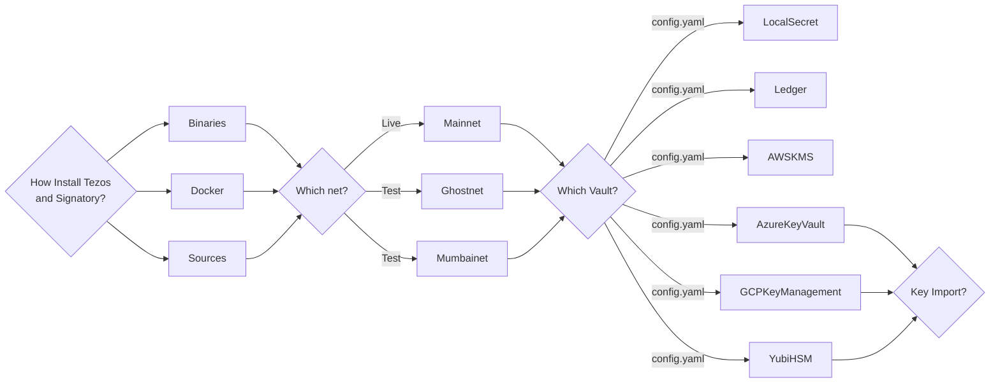

# How to use Signatory with a Tezos Baker

A Tezos node can be installed from binaries, or run with docker, or built from sources (for details see [here](https://teztnets.xyz/)) . In each case a baker is set up with a network and a vault, but each vault has unique requirements. This diagram shows the range of configurations supported by Signatory. There are `3x3x6=54` variations shown, and more are possible. This article will introduce baking and test networks but will focus on the configration details required for baking with each supported vault type.


## Bakers on Tezos Networks

Things you will need to know:
- a working octez-client instance
- the host_address for a Tezos Node`
    - in this example we will host a node locally at `http://localhost:8732`
- a public_key_hash to be the baker
    - e.g. `tz1iUqDimrzPmYuWbmLgWwX73YF7dBcaJryU`
- the protocol running on the network used
    - e.g. `PtMumbai`

Verify the node:

```
curl ${host_address}/chains/main/is_bootstrapped
```

List known addresses :

```
./octez-client list known addresses

alice: tz1iUqDimrzPmYuWbmLgWwX73YF7dBcaJryU (unencrypted sk known)

```


Show the baker address and secret key:

```
./octez-client show address -S alice

Hash: tz1iUqDimrzPmYuWbmLgWwX73YF7dBcaJryU
Public Key: edpktmKfj5reMbPmgwh2BNw5EHYpHEZZceMWfffcEpfPTn6pXgoRwF
Secret Key: unencrypted:edsk2hf8Y9oYMQ9MiEAH9pbs3H7tpcBbyxjcWuRjJCrGPB81bDHC7s
```

Ensure minimum required balance for baking rights. To get funds, use the [faucets](https://teztnets.xyz/). This has to wait util bootstrapping is complete.

```
./octez-client get balance for alice
```

Register the implict account as a delegate. We can use a consensus key as well:

```
./octez-client register key alice as delegate

./octez-client register alice as delegate with consensus key bob
```

Check for baking rights. Depending on the network used this can take days. You will need to guess at the cycle parameter.

```bash!
./octez-client rpc get /chains/main/blocks/head/helpers/baking_rights?cycle=<cycle>&delegate=${public_key_hash}

```
To start the baker :
```bash!
./octez-baker-alpha run with local node ~/.tezos-node --liquidity-baking-toggle-vote pass
```
## Signatory

Clone Signatory from its Github repository or run with docker .

```
git clone <https://github.com/daily-co/signatory.git>
```

Build Signatory:

```
cd signatory
make signatory
make signatory-cli
```


### 1. Local Secret
This is not a secure method of key storage but it is the simplest example.
Create a file /etc/secret.json and populate it with the PKH and secret key for the baker
```json!
[
  {
    "name": "tz1iUqDimrzPmYuWbmLgWwX73YF7dBcaJryU",
    "value": "unencrypted:edsk2hf8Y9oYMQ9MiEAH9pbs3H7tpcBbyxjcWuRjJCrGPB81bDHC7s"
  }
]
```
Create a `local_secret.yaml` file with the following content. 

```
server:
  address: :6732
  utility_address: :9583

vaults:
  local_secret:
    driver: file
    config:
      file: /etc/secret.json
      
  tezos:
    tz1iUqDimrzPmYuWbmLgWwX73YF7dBcaJryU:
      log_payloads: true
      allowed_operations:
      - generic
      - block
      - endorsement
      - preendorsement
      allowed_kinds:
      - reveal
      - delegation
```

Start Signatory :

```
./signatory serve -c ./signatory.yaml
```

Test that Signatory is working :

```bash!
curl localhost:6732/keys/tz1iUqDimrzPmYuWbmLgWwX73YF7dBcaJryU

{"public_key":"edpktmKfj5reMbPmgwh2BNw5EHYpHEZZceMWfffcEpfPTn6pXgoRwF"}


./signatory-cli list -c local_secret.yaml

INFO[0000] Initializing vault                            vault=file vault_name=local_secret
Public Key Hash:    tz1iUqDimrzPmYuWbmLgWwX73YF7dBcaJryU
Vault:              File
ID:                 tz1iUqDimrzPmYuWbmLgWwX73YF7dBcaJryU
Active:             false
```
Import the key Signatory provides into octez-client, overriding the key alice created earlier.

```bash!
./octez-client import secret key alice http://localhost:6732/tz1iUqDimrzPmYuWbmLgWwX73YF7dBcaJryU --force
```
Check the tezos node secret key file:
```bash!
cat ~/.tezos-client/secret_keys
[{ "name": "alice",
    "value": "http://localhost:6732/tz1iUqDimrzPmYuWbmLgWwX73YF7dBcaJryU"
}]
```

Do a tezos transfer operation:
```bash!
./octez-client transfer 10 from alice to bob
```
and check the signatory logs
```go!
INFO[0006] Requesting signing operation                  ops="map[transaction:1]" ops_total=1 pkh=tz1iUqDimrzPmYuWbmLgWwX73YF7dBcaJryU request=generic vault=File vault_name=local_secret
INFO[0006] About to sign raw bytes                       ops="map[transaction:1]" ops_total=1 pkh=tz1iUqDimrzPmYuWbmLgWwX73YF7dBcaJryU raw=034266bedbf77c4e104790c8c3e7ca81cef9aa2f63770ae27d9032c670902f03e76c00fa8d929d0a3eb3a509e16bd6aec74e6c18783432e102fd13e9070080ade20400005cf5b8fb0209b20765b88233de1700896d4d084a00 request=generic vault=File vault_name=local_secret
INFO[0006] Signed generic successfully                   ops="map[transaction:1]" ops_total=1 pkh=tz1iUqDimrzPmYuWbmLgWwX73YF7dBcaJryU request=generic vault=File vault_name=local_secret
```


### 2. Ledger Devices

Make sure that the ledger device is able to work with your linux system and is enabled through udev rules. Some examples can be found [here](https://github.com/LedgerHQ/udev-rules)

Make sure that tezos client can access the ledger:
```bash!
./octez-client list connected ledgers

## Ledger `elated-beaver-unusual-nightingale`
Found a Tezos Baking 2.3.2 (git-description: "") application running on
Ledger Nano S at [0001:0029:00].

To use keys at BIP32 path m/44'/1729'/0'/0' (default Tezos key path), use one
of:
  octez-client import secret key ledger_michael "ledger://elated-beaver-unusual-nightingale/bip25519/0h/0h"
  octez-client import secret key ledger_michael "ledger://elated-beaver-unusual-nightingale/ed25519/0h/0h"
  octez-client import secret key ledger_michael "ledger://elated-beaver-unusual-nightingale/secp256k1/0h/0h"
  octez-client import secret key ledger_michael "ledger://elated-beaver-unusual-nightingale/P-256/0h/0h"
```

Use the appropriate import command for the elliptic curve you plan to use to get the ledger keys into octez-client

```bash!
./octez-client import secret key ledger_michael "ledger://elated-beaver-unusual-nightingale/bip25519/0h/0h"

Please validate (and write down) the public key hash displayed on the Ledger,
it should be equal
to `tz1bQYMFieZHomNPjJvpp2g7PuhxRPDxpnFt`:
Tezos address added: tz1bQYMFieZHomNPjJvpp2g7PuhxRPDxpnFt
```
Review the Request on the ledger device and approve it.


Ensure the implicit account used has funds for a baking stake. (Use the [faucet](https://teztnets.xyz/))

Set up ledger for baking 
```
./signatory-cli ledger setup-baking bip25519/0h/0h -c signatory.yaml 

INFO[0000] Initializing vault    
vault=ledger vault_name=ledger
Authorized baking for address: tz1Kiak7gwhv6fvcpq9Q9ghjKNuFNYDtUJUG
```

Determine the ID of the ledger device. 
```bash!
./signatory-cli ledger list -c signatory.yaml
  
Path:           0001:0029:00
ID:             elated-beaver-unusual-nightingale / 00f24232
Version:        TezBake 2.3.2
```

The ID is used by the signatory.yaml file to identify the ledger
Set up the Signatory configuration file like this, and save it a `ledger.yaml`:

```bash!
server:
  address: :6732
  utility_address: :9583

vaults:
  ledger:
    driver: ledger
    config:
      id: 00f24232
      keys:
        - "bip32-ed25519/0'/0'"
        - "secp256k1/0'/1'"
      close_after: 600800s

tezos:
  tz1bQYMFieZHomNPjJvpp2g7PuhxRPDxpnFt:
    log_payloads: true
    allow:
      generic:
        - transaction
        - endorsement
        - proposals
      block:
      endorsement:
      preendorsement:
```
where we have added the Ledger ID and the ledger's public key hash that we imported to octez-client.

Start signatory from the CLI or with Docker:
```
./signatory-cli ledger setup-baking ed25519/0h/0h -c sig-ledger.yaml --base-dir .
```
Review and permit the request on the ledger device.
```

Get the public key hash from the ledger device

```bash!
./signatory-cli list -c ledger.yaml 

INFO[0000] Initializing vault                            vault=ledger vault_name=ledger
Public Key Hash:    tz1bQYMFieZHomNPjJvpp2g7PuhxRPDxpnFt
Vault:              Ledger
ID:                 bip32-ed25519/44'/1729'/0'/0'
Active:             true
Allowed Requests:   [block endorsement generic preendorsement]
Allowed Operations: [endorsement proposals transaction]
```
Check the logs for the baker to see that endorsing is working
```bash!
Mar 22 12:09:44.815 - 016-PtMumbai.baker.actions: injected preendorsement op8Pj4ot1oZ3YmmUhxeTKiH83SUazCVDVgZzqgKb1DKj68vr8a1
Mar 22 12:09:44.815 - 016-PtMumbai.baker.actions:   for blueledger (tz1bQYMFieZHomNPjJvpp2g7PuhxRPDxpnFt)
Mar 22 12:09:46.596 - 016-PtMumbai.baker.actions: injected endorsement ooee4W7k4oNSLRZu62aZQwhkahmWRngbEnJZ5CopsXGantGemzd for
Mar 22 12:09:46.596 - 016-PtMumbai.baker.actions:   blueledger (tz1bQYMFieZHomNPjJvpp2g7PuhxRPDxpnFt)
```
See the endorsing in the Signatory logs:
```go!
INFO[1910525] Requesting signing operation                  chain_id=NetXQw6nWSnrJ5t lvl=457542 pkh=tz1bQYMFieZHomNPjJvpp2g7PuhxRPDxpnFt request=preendorsement vault=Ledger vault_name=00f24232
INFO[1910525] About to sign raw bytes                       chain_id=NetXQw6nWSnrJ5t lvl=457542 pkh=tz1bQYMFieZHomNPjJvpp2g7PuhxRPDxpnFt raw=122f6cbd6119f3a10704d101a5d13334809adce2e9d3011c6cead4b975a8d39f91c87273e714001e0006fb4600000082c6194912098ea5a9a7d52a593e4783afb36f3965780b242eb1e271c1159cc946 request=preendorsement vault=Ledger vault_name=00f24232
INFO[1910527] Signed preendorsement successfully            chain_id=NetXQw6nWSnrJ5t lvl=457542 pkh=tz1bQYMFieZHomNPjJvpp2g7PuhxRPDxpnFt request=preendorsement vault=Ledger vault_name=00f24232
INFO[1910527] POST /keys/tz1bQYMFieZHomNPjJvpp2g7PuhxRPDxpnFt  duration=1.772184564s hostname="localhost:6732" method=POST path=/keys/tz1bQYMFieZHomNPjJvpp2g7PuhxRPDxpnFt start_time="2023-03-08T10:26:30-08:00" status=200
```
### 3. Yubi HSM
Follow the Signatory Vault installation instructions for Yubi HSM at https://signatory.io/docs/yubihsm

Signatory will expose the key in the vault to the baker. The set up of keys and bakers is the same as for the simpler examples above. The baker needs to be setup for baking with the key as supplied by Signatory.

```bash!
server:
  address: localhost:6732
  utility_address: localhost:9583

vaults:
  yubi:
    driver: yubihsm
    config:
      address: localhost:12345 # Address for the yubihsm-connector
      password: password
      auth_key_id: 1
      
tezos:
  tz3fK7rVYSg2HTEAmUYdfjJWSDGfsKrxH3xQ:
    log_payloads: true
    allow:
      block:
      endorsement:
      preendorsement:
      generic:
        - transaction
```
With Baker, Signatory and Yubi set up you should see in the yubi logs:
```go!
INFO[0668] handled request                               Content-Length=13 Content-Type=application/octet-stream Method=POST RemoteAddr="127.0.0.1:38524" StatusCode=200 URI=/connector/api User-Agent=Go-http-client/1.1 X-Real-IP=127.0.0.1 X-Request-ID=74d3cc1b-6f8b-4e73-afdd-25af90054a32 latency=10.879542ms
DEBU[0668] usb device already open                       Correlation-ID=e08fb56a-deac-4d28-8069-39b41b7f6892
DEBU[0668] usb endpoint write                            Correlation-ID=e08fb56a-deac-4d28-8069-39b41b7f6892 buf="[4 0 17 2 199 78 161 173 85 75 86 143 162 70 155 208 62 14 98 48]" err="<nil>" len=20 n=20
DEBU[0668] usb endpoint read                             Correlation-ID=e08fb56a-deac-4d28-8069-39b41b7f6892 buf="[132 0 0]" err="<nil>" len=3 n=3
```
### 4. Azure Key Vault
Follow the Signatory Vault installation instructions for Azure Key Vault at https://signatory.io/docs/azure_kms

Signatory will expose the key in the vault to the baker. The set up of keys and bakers is the same as for the simpler examples above. The baker needs to be setup for baking with the key as supplied by Signatory.

```bash!
server:
  address: :6732
  utility_address: :9583

vaults:
  azure:
    driver: azure
    config:
      vault: https://sigy.vault.azure.net/
      tenant_id: 50a7adf11-1a9a-4b76-b468-1acdb03a8f69e
      client_id: b673iu8cc5-98c9-44ac-a688-7cafcdb9b9bcb4
      client_private_key: service-principal.key
      client_certificate_thumbprint: 643F14403B695090D8ABDC34ABBE7EF2423497352
      subscription_id: be223726da0-6dc1-4cdc-ab26-15a082bdaaa908
      resource_group: sigy

tezos:
  tz3d6nYmR1LmSDsgJ463Kgd8EbH53pYnuv8S:
    log_payloads: true
    allow:
      block:
      endorsement:
      preendorsement:
      generic:
        - transaction
        - reveal
        - delegation
```

### 5. AWS KMS
Follow the Signatory Vault installation instructions for AWS KMS at https://signatory.io/docs/aws_kms

Signatory will expose the key in the vault to the baker. The set up of keys and bakers is the same as for the simpler examples above. The baker needs to be setup for baking with the key as supplied by Signatory.

```bash!
server:
  address: :6732
  utility_address: :9583
  
vaults:
  aws:
    driver: awskms
    config:
      user_name: <iam_username>
      access_key_id: <aws_access_key_id>
      secret_access_key: <aws_secret_access_key>
      region: <aws_region>

tezos:
  tz3fK7rVYSg2HTEAmUYdfjJWSDGfsKrxH3xQ:
    log_payloads: true
    allow:
      block:
      endorsement:
      preendorsement:
      generic:
        - transaction
``` 
### 6. GCPKeyManagement
Follow the Signatory Vault installation instructions for GCPKeyManagement at https://signatory.io/docs/gcp_kms

Signatory will expose the key in the vault to the baker. The set up of keys and bakers is the same as for the simpler examples above. The baker needs to be setup for baking with the key as supplied by Signatory.

```bash!
server:
  address: :6732
  utility_address: :9583

vaults:
  gcp:
    driver: cloudkms
    config:
      project: <gcp_project>
      location: <gcp_region>
      key_ring: <key_ring_name>
      application_credentials: <credentials_file_path>
      
tezos:
  tz3fK7rVYSg2HTEAmUYdfjJWSDGfsKrxH3xQ:
    log_payloads: true
    allow:
      block:
      endorsement:
      preendorsement:
      generic:
        - transaction
```

