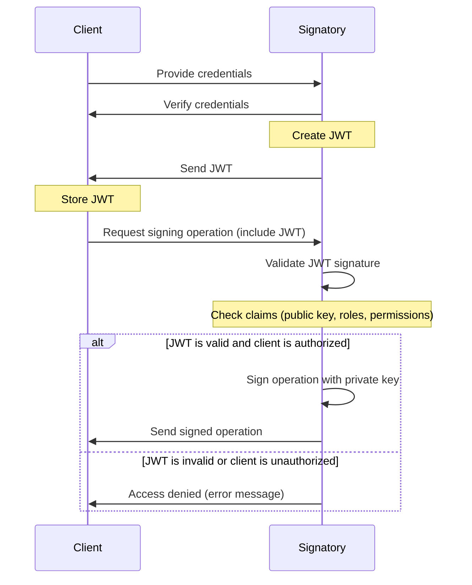

# JWT - Signatory interaction

The diagram represents a sequence of interactions between a client and a Signatory service, which appears to be a service that handles cryptographic signing operations. Here is a breakdown of the sequence of interactions:



1. The client provides its credentials to the Signatory service.
2. The Signatory service verifies the credentials provided by the client.
3. If the credentials are valid, the Signatory service creates a JSON Web Token (JWT) and sends it to the client.
4. The client stores the JWT for later use.
5. The client requests a signing operation from the Signatory service, and includes the JWT in the request.
6. The Signatory service validates the JWT signature and checks the claims in the JWT (such as the public key, roles, and permissions).
7. If the JWT is valid and the client is authorized, the Signatory service signs the operation with its private key and sends the signed operation back to the client.
8. If the JWT is invalid or the client is unauthorized, the Signatory service sends an access denied error message to the client.
9. When the token expires or any other token authentication failures happen, the client can start again from 1. 

## Sample Signatory JWT configuration

`jwt_exp` is the time duration (in minutes) for which the token is valid and it is optional. When not provided the token expiry is `current time + maximum Golang int64 ≈ 280 years`, otherwise it is `current time + given time`.   

`secret` is the secret used to sign the JWT token.

```yaml
server:
  address: :6732
  utility_address: :9583
  jwt:
    users:
      user_name1:
        password: password1
        secret: secret1
        jwt_exp: 234
      user_name2:
        password: password2
        secret: secret2
        jwt_exp: 73
```

## Sample client code which used in the integration test.

```go
        //Send user credentials to receive a new token
        url := "http://localhost:6732/login" + pub.Hash().String()
		client := &http.Client{}

		req, err := http.NewRequest("POST", url, nil)
		require.NoError(t, err)

		req.Header.Add("Content-Type", "application/json")
		req.Header.Add("username", "user1")
		req.Header.Add("password", "pass123")
		time.Sleep(2 * time.Second)

		res, err := client.Do(req)
		require.NoError(t, err)
		require.Equal(t, 201, res.StatusCode)

		body, err := ioutil.ReadAll(res.Body)
		require.NoError(t, err)
		require.NotEmpty(t, body)

		res.Body.Close()

		// Send request using received token

		client = &http.Client{}

		req, err = http.NewRequest("GET", url, nil)
		require.NoError(t, err)

		req.Header.Add("Content-Type", "application/json")
		req.Header.Add("Authorization", "Bearer "+string(body))
		req.Header.Add("username", "user1")
		time.Sleep(2 * time.Second)

		res, err = client.Do(req)
		require.NoError(t, err)
		require.Equal(t, 200, res.StatusCode)

		defer res.Body.Close()
		body, err = ioutil.ReadAll(res.Body)
		require.NoError(t, err)
		require.NotEmpty(t, body)

		fmt.Println("Response-GET-PKH: ", string(body))
```

## Credentials rotation

The credentials can be rotated by updating the configuration file and restarting the Signatory service.

Older credentials can be removed from the configuration file after the new credentials are added and signatory is up and serving. The Signatory service will continue to accept the older credentials until the `old_cred_exp` (minutes) time expires. Defaults to 30 minutes if not provided.

### sample configuration file:

```yaml
server:
  address: :6732
  utility_address: :9583
  jwt:
    users:
      user_name1:
        password: password1
        secret: secret1
        jwt_exp: 234
        old_cred_exp: 10
        new_data:
          password: password1
          secret: secret1
          jwt_exp: 35
```

## JWT users for each PKH

The JWT users can be configured for each PKH in the configuration file. Even if the JWT client provides a valid token, the request will be rejected if the user is not configured for that PKH requested for signing.
If no JWT users are configured for a PKH, then any JWT token will be accepted for that PKH.

### sample configuration file:

```yaml
tezos:
  tz3cbDCwrqFqfx1dBhHoXTwZ9FG3MDrtyMs6:
    jwt_users:
      - user_name1
      - user_name2
    log_payloads: true
    allow:
      block:
      endorsement:
      preendorsement:
      generic:
        - transaction
        - reveal
```

## Important security note:

TLS should be taken care by the user who configures JWT as the authentication mechanism in Signatory for the clients.

The configuration file also contains sensitive information when using JWT with Signatory, so that file must also be secure.