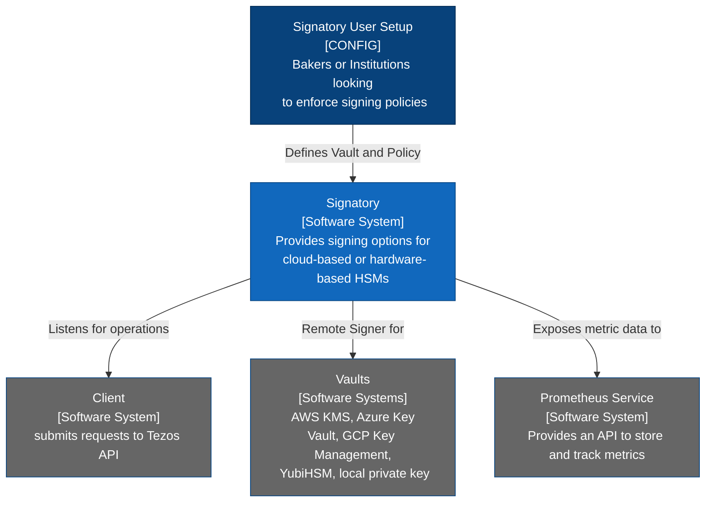
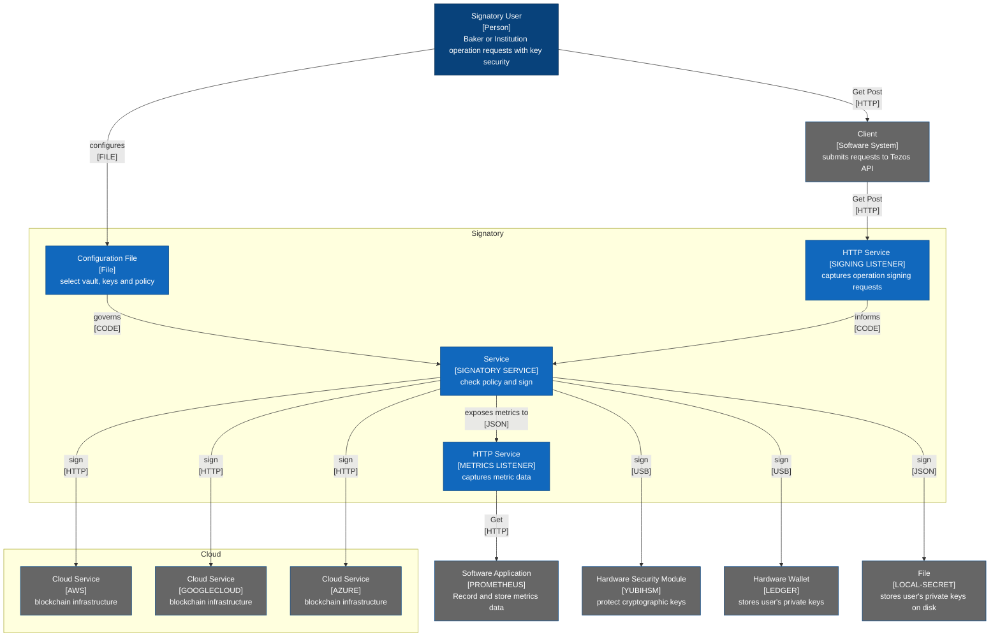
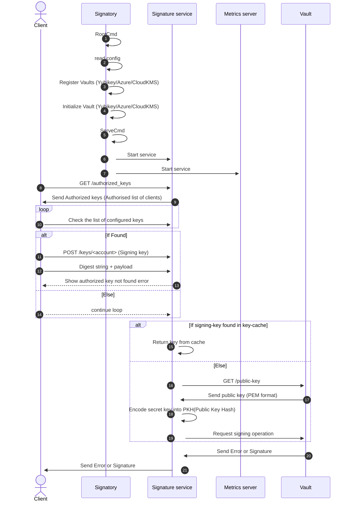
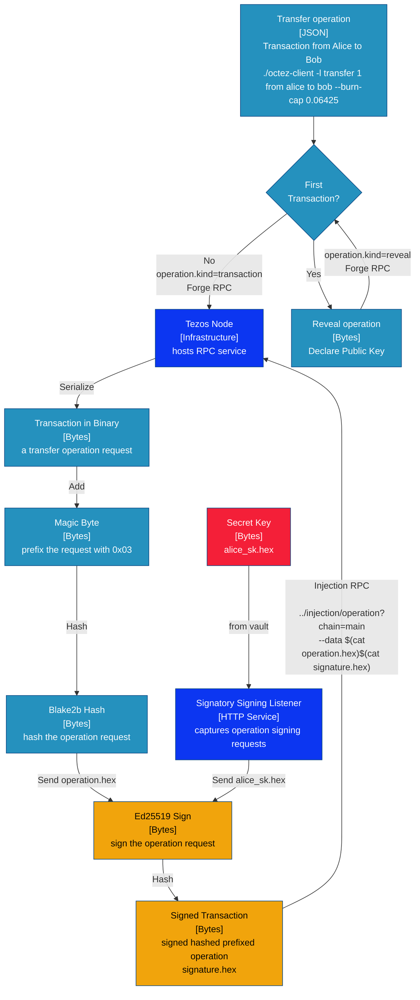
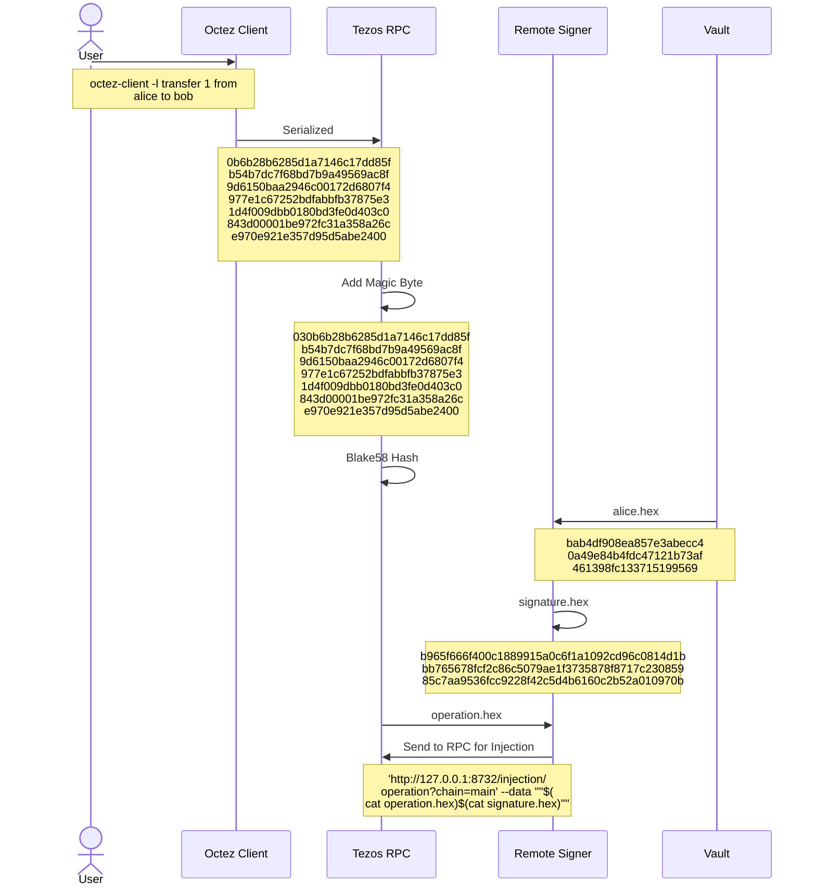

# Signatory C4 Architecture Model 

Signatory is the perfect solution for secure and reliable remote signing in Tezos Blockchain cases. With easy-to-use configuration options, users can set up vaults and policies to ensure that only authorized operations are signed. Signatory also supports a variety of hardware-based and cloud-based HSMs, such as [AWS KMS](https://aws.amazon.com/kms/) and [YubiHSM](https://www.yubico.com/?utm_source=google&utm_medium=pd:search&utm_campaign=US_B2C_LeadGen_Google_SEM_Brand&utm_content=&gclid=CjwKCAiAmJGgBhAZEiwA1JZolnAOjpSi_GVY8qz7NyLHASwkXHBu2t1aPNWl2WWHl4Nb2S19OsAWMBoCGucQAvD_BwE), to protect cryptographic keys.

Using Signatory, users can securely store their secret keys and control which operations can be signed, reducing the risk of losing or having their keys stolen. Signatory also allows users to sign transactions on hardware not connected to the internet, providing an additional layer of security.

[C4 architecture diagrams](https://c4model.com/) are visual modelling languages used to communicate software system architectures. They are designed to be simple, easy to understand and provide a high-level view of a system's components and how they interact. C4 diagrams are typically organized into a hierarchy of increasing detail, with each view building on the previous one.

[Domain-driven design](https://martinfowler.com/tags/domain%20driven%20design.html) ([DDD](https://learn.microsoft.com/en-us/archive/msdn-magazine/2009/february/best-practice-an-introduction-to-domain-driven-design)) is a software development approach emphasizing the importance of understanding the business domain to create effective software solutions. C4 diagrams can help developers understand the domain of the system they are building and design software that aligns with the domain concepts and principles. By using C4 diagrams to visualize the system's architecture, developers can better understand how the system fits into the larger business context and how the different components of the system interact with one another.

The C4 system architectural model is a set of diagrams used to represent the architecture of a software system. There are four levels in the C4 model, each providing an increasing level of detail about the software system.

1. System Context Diagram: This is the highest level of the C4 model and provides a high-level view of the software system and its environment. It shows the system as a box in the center, surrounded by its users and other systems it interacts with. The diagram also shows the relationships between the system and its environment, such as data flow and requests.
2. Container Diagram: The container diagram shows the software system as a set of containers, each containing its own set of components. It shows how the different containers interact with each other to form a larger system. This level of the C4 model provides more detail about the software system's components and their interactions.
3. Component Diagram: The component diagram provides a more detailed view of the software system's components and their interaction. It shows the internal structure of each container and the relationships between the components. This level of the C4 model provides a detailed view of the software system's components and their interactions.
4. Code Diagram: This is the lowest level of the C4 model, and it provides a detailed view of the code structure of each component. It shows the classes, functions, and other code artifacts that make up each component.

There is no requirement to detail every container and component. Often the high-level description is enough to convey the required understanding. It is also unnecessary to detail the code level, as a sufficiently detailed component diagram can suffice.

### 1. Signatory System Context

For Signatory, a remote signer application for the Tezos blockchain, the C4 system context diagram shows the Signatory software system as the central box. The diagram includes the Signatory user, responsible for setting up the system's configuration, and the client software system, which submits requests to the Tezos API. The diagram also shows various vaults, such as AWS KMS and YubiHSM, which Signatory uses to store cryptographic keys, and the Prometheus service, which stores and tracks metrics data.

### 2. Signatory Container Model
The Signatory container model is a C4 architecture diagram showing the different elements of the Signatory system. The diagram shows the Signatory software system as the central container, with various supporting software systems surrounding it. These supporting systems include client software for submitting requests to the Tezos API, the Prometheus service for storing metrics data, and various hardware-based and cloud-based HSMs for protecting cryptographic keys. The diagram also shows Signatory's different vaults to store cryptographic keys, such as AWS KMS and YubiHSM. 

### 3. Signatory Component Model 
A sequence diagram is a way to express the behaviour of the underlying code in a software system. It shows the interactions between different system components over time, highlighting how the system behaves and responds to different inputs. Using a sequence diagram, developers can better understand the flow of data and control within the system and identify potential issues or areas for improvement.

The sequence diagram for the Signatory remote signer application shows the behaviour of the underlying code in the system. It highlights how the different components of the system interact with one another over time, showing the flow of data and control within the system. Using a sequence diagram, developers can better understand how the system behaves and identify potential issues or areas for improvement.

### 4. Tezos Signing Component Model

Tezos uses elliptic curve cryptography to manage private/public key addresses, sign data, and check signatures. Signing a transaction involves hashing the operation request, prefixing it with a watermark, and then signing the resulting byte string with the user's secret key. The signature is then appended to the operation request to create a signed transaction, which can be broadcast to the network for confirmation.

Diagram adapted from [An Introduction to Tezos RPCs: Signing Operations](https://ocamlpro.com/blog/2018_11_21_an_introduction_to_tezos_rpcs_signing_operations/)

### Simplified Signing Model
This Mermaid sequence diagram is a simplified depiction of signing a transaction on the Tezos blockchain.

- The transaction is first forged using the Tezos RPC.
- The resulting operation hexadecimal is then sent to a remote signer for signing.
- The remote signer receives the operation and the secret key corresponding to the sender's address (in this case, Alice's).
- The remote signer signs the transaction and returns the resulting signature hexadecimal.
- The signed transaction is then sent back to the Tezos RPC for injection into the blockchain. 

