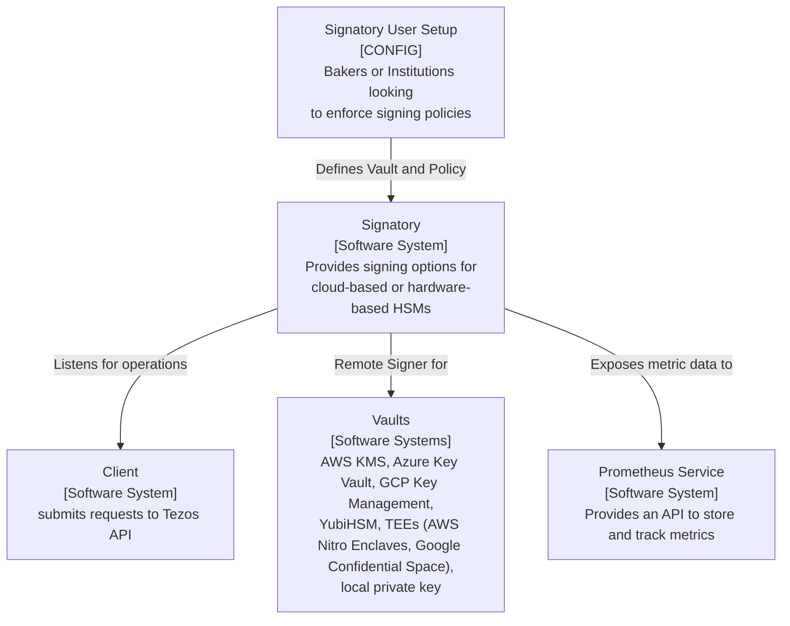
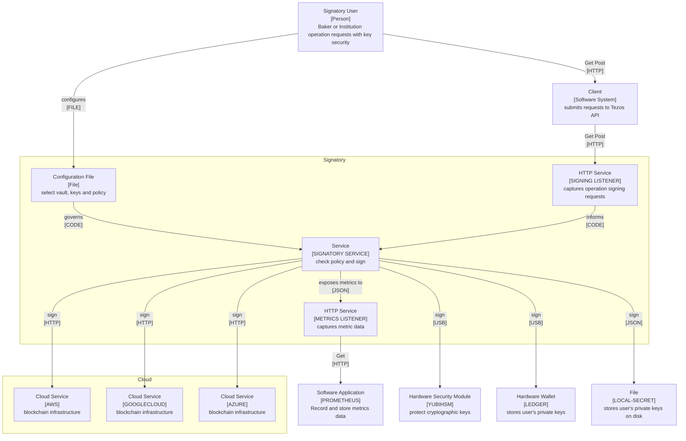
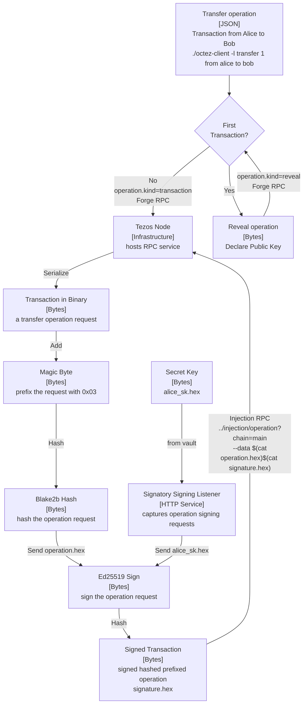

# Signatory Architecture  

Signatory is an excellent solution for secure and reliable remote signing in Tezos Blockchain cases. With easy-to-use configuration options, users can set up vaults and policies to ensure that only authorized operations are signed. Signatory supports a variety of hardware-based and cloud-based HSMs, such as [AWS KMS](https://aws.amazon.com/kms/) and [YubiHSM](https://www.yubico.com/), as well as Trusted Execution Environments (TEEs) like AWS Nitro Enclaves and Google Confidential Space to protect cryptographic keys and execution.

Using Signatory, users can securely store their secret keys and control which operations can be signed, reducing the risk of losing or having their keys stolen. Signatory also allows users to sign transactions on hardware not connected to the internet, providing an additional layer of security.

### 1. Signatory System Context

The diagram demonstrated the overall high level Signatory system and includes the Signatory user, responsible for setting up the system's configuration, and the client software system, which submits requests to the Tezos API. The diagram also shows various vaults, such as AWS KMS and YubiHSM, which Signatory uses to store cryptographic keys, and the Prometheus service, which pulls and aggregates metrics data.

### 2. Signatory Container Model
The Signatory container diagram shows the different elements of the Signatory system, including Signatory as the central container, with various supporting software systems surrounding it. These supporting systems include client software for submitting requests to the Tezos API, the Prometheus service for storing metrics data, and various hardware-based and cloud-based HSMs for protecting cryptographic keys. The diagram also shows Signatory's different vaults to store cryptographic keys, such as AWS KMS and YubiHSM. 

### 3. Signatory Component Model 
A sequence diagram is a way to express the behaviour of the underlying code in a software system. It shows the interactions between different system components over time, highlighting how the system behaves and responds to different inputs. Using a sequence diagram, developers can better understand the flow of data and control within the system and identify potential issues or areas for improvement.

The sequence diagram for the Signatory remote signer application shows the behaviour of the underlying code in the system. It highlights how the different components of the system interact with one another over time, showing the flow of data and control within the system. Using a sequence diagram, developers can better understand how the system behaves and identify potential issues or areas for improvement.

### 4. Tezos Signing Component Model

Tezos uses elliptic curve cryptography to manage private/public key pairs, sign data, and check signatures. Signing a transaction involves prefixing it with a magic-byte, hashing the operation request, and then signing the resulting byte string with the user's secret key. The signature is then appended to the operation request to create a signed transaction, which can be broadcast to the network for confirmation.

Diagram adapted from [An Introduction to Tezos RPCs: Signing Operations](https://ocamlpro.com/blog/2018_11_21_an_introduction_to_tezos_rpcs_signing_operations/)

### Simplified Signing Model
This Mermaid sequence diagram is a simplified depiction of signing a transaction on the Tezos blockchain.

- The transaction is first forged using the Tezos RPC.
- The resulting operation hexadecimal is then sent to a remote signer for signing.
- The remote signer receives the operation and the secret key corresponding to the sender's address (in this case, Alice's).
- The remote signer signs the transaction and returns the resulting signature hexadecimal.
- The signed transaction is then sent back to the Tezos RPC for injection into the blockchain. 

