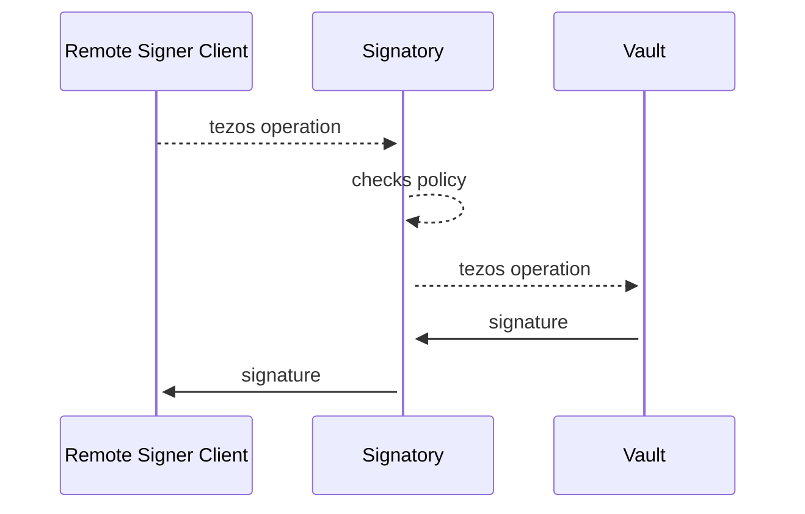

[aws]: https://aws.amazon.com/kms/
[azure]: https://docs.microsoft.com/en-us/azure/key-vault/
[gcp]: https://cloud.google.com/security-key-management
[yubi]: https://www.yubico.com/products/hardware-security-module/
[hashicorp]: https://developer.hashicorp.com/vault/docs/secrets/transit


## What is Signatory

Signatory is a remote signing daemon that allows Tezos bakers to sign attestation and baking operations with various key-management systems.

Signatory currently supports [AWS KMS][aws], [Azure Key Vault][azure], [GCP Key Management][gcp], [YubiHSM][yubi], [Hashicorp Vault][hashicorp], and Confidential Computing TEEs such as [AWS Nitro Enclaves](nitro.md) and [Google Confidential Space](confidential_space.md). For development/prototyping purposes, Signatory can also sign with a [local private key](localsecret.md).

The goal of the Signatory service is to make key management as secure as possible in a Cloud and on-premise HSM context.

Security and convenience are often opposed, but we hope to make it easier for the community to manage their keys in an adequately secure manner.

By supporting multiple Cloud KMS/HSM systems, we hope to help the network from centralization on a particular Cloud offering. In the first year of the Tezos network operation, there was anecdotal evidence that many bakers run on AWS. AWS is a superb provider, but concentrating nodes on one cloud vendor centralizes the network's underlying infrastructure, which is not desirable.

Observability is a first-class concern. Signatory allows for rich reporting and alerting capabilities. It exposes metrics about its operation via Prometheus metrics, enabling teams to set up robust monitoring of their critical infrastructure and allowing operators to see historical trends, signing volumes, errors and latencies. Users can report feature requests, security issues, or bug reports can via the Github project page: 
github.com/ecadlabs/signatory or via email to security@ecadlabs.com

## How Signatory Works

* A Tezos operation is sent to the Signatory API
* Signatory decodes and checks that the operation is permitted based on the defined policy
* Signatory sends the operation to the configured vault backend for signing
* Upon receiving the signature produced by backend, Signatory validates the signature
* Signatory returns the signature to Signatory client



## Configuration

Signatory configuration is specified in a YAML file. Use the `signatory.yaml` file as a template to get started.

You can configure multiple `vault`s. Each `vault` should be configured to use a backend. Same backend can be used in more than one `vault`.

The configuration file is shared between `signatory` and `signatory-cli`.

:::note Baker Operations
For bakers, ensure your configuration includes `attestation` and `preattestation` operations. If you're running a DAL node, also add `attestation_with_dal` to participate in DAL attestations and earn additional rewards. See the [Bakers guide](bakers.md) for detailed configuration examples.
:::

### Configuration Example - File-based Vault

> :warning: **We don't recommend using the `file` Vault driver in Production.** 

The file-based vault relies on a file containing your wallet's private keys. The `file` vault driver is the least secure of them all compared to the YubiHSM and Cloud KMS drivers; However, it's the easiest Vault to set up when trying Signatory for the first time as it doesn't require you to have a YubiHSM nor a Cloud provider account. 

`/etc/signatory/signatory.yaml`
```yaml
server:
  # Address for the main HTTP server to listen on
  address: :6732
  # Address for the utility HTTP server (for Prometheus metrics) to listen on
  utility_address: :9583

vaults:
  # Name is used to identify backend during import process
  local_file:
    driver: file
    config:
      file: /etc/signatory/secret.json

watermark:
  # Default
  driver: file

# List enabled public keys hashes here
tezos:
  # Default policy allows "block" and "attestation" operations
  tz1Wz4ZabKRsz842Xuzy4a7CcWADfPVsPKus:

  # Explicit policy
  tz3MhmeqpudUqEX8PYTbNDF3CVcnnjNQoo8N:
    # Setting `log_payloads` to `true` will cause Signatory to log operation
    # payloads to `stdout`. This may be desirable for audit and investigative
    # purposes.
    log_payloads: true
    allow:
      block:
      attestation:        # Modern terminology (was "endorsement")
      preattestation:     # Modern terminology (was "preendorsement")
      attestation_with_dal: # Required for DAL participation
      failing_noop:
      generic:
        - transaction
        - reveal
        - delegation
        - origination
```

`/etc/signatory/secret.json`
```json
[
  {
    "name": "tz1Wz4ZabKRsz842Xuzy4a7CcWADfPVsPKus",
    "value": "unencrypted:<unencrypted_private_key>"
  },
  {
    "name": "tz3MhmeqpudUqEX8PYTbNDF3CVcnnjNQoo8N",
    "value": "unencrypted:<unencrypted_private_key>"
  }
]
```

### Configuration Example - AWS KMS Vault
This configuration example uses AWS KMS as  

```yaml
server:
  # Address for the main HTTP server to listen on
  address: :6732
  # Address for the utility HTTP server (for Prometheus metrics) to listen on
  utility_address: :9583

vaults:
  # Name is used to identify backend during import process

  # AWS KMS backend
  aws:
    driver: awskms
    config:
      access_key_id: <redacted> # Optional
      secret_access_key: <redacted> # Optional 
      region: us-west-2 

tezos:
  tz3MhmeqpudUqEX8PYTbNDF3CVcnnjNQoo8N:
    allow:
      block:
      attestation:        # Modern terminology (was "endorsement")
      preattestation:     # Modern terminology (was "preendorsement")
      attestation_with_dal: # Required for DAL participation
      failing_noop:
      generic:
        - delegation
        - transaction
```

### Watermark Backend

Watermarks are a critical safety feature in Signatory that prevent double-signing operations at the same block level or round. They track the highest level/round that has been signed for each key and operation type, rejecting any requests to sign at or below that level.

Basic syntax:

```yaml
# Optional
watermark:
  driver: <driver>
  # Optional
  config: <config_object>
```

Three backends are supported:
- `file` (default) - Stores watermarks in the local filesystem
- `mem` - In-memory storage (for testing only, not persistent)
- `aws` - Uses AWS DynamoDB for distributed watermark storage

For distributed validator setups where multiple Signatory instances share signing responsibilities, the AWS DynamoDB backend is recommended.

For detailed information about watermarks, their importance, and configuration options, see the [Watermarks](watermarks.md) documentation. For specific AWS DynamoDB setup, see [AWS DynamoDB Watermark Backend](aws_dynamodb.md).

## Backends
* [AWS KMS](aws_kms.md)
* [Azure Key Vault](azure_kms.md)
* [GCP Key Management](gcp_kms.md)
* [YubiHSM2](yubihsm.md)
* [Hashicorp Vault](hashicorp_vault.md)
* [PKCS#11](pkcs11.md)
* [Nitro](nitro.md)

---

## Signatory service

Signatory service is used for signing operations and implements Tezos specific HTTP external signer API

```
A Tezos Remote Signer for signing block-chain operations with private keys

Usage:
  signatory [flags]
  signatory [command]

Available Commands:
  help        Help about any command
  serve       Run a server

Flags:
  -c, --config string   Config file path (default "signatory.yaml")
  -h, --help            help for signatory
      --log string      Log level: [error, warn, info, debug, trace] (default "info")
```

### Prometheus metrics and health service

Signatory exposes Prometheus metrics and health status on the address specified in `utility_address` configuration parameter. The default value is `:9583`.

#### Prometheus metrics

Metrics include counters and histograms that track signing operations and errors.

The metrics are intended to be scraped using the Prometheus time series database. We also publish a ready-made Grafana dashboard that users can use to visualize the operation of their signing operations. (TODO: publish Grafana dashboard)

`localhost:9583/metrics`

#### Health service

The health service endpoint can be used to test if the service is running correctly and is ready to sign requests.

This endpoint is useful for monitoring, or declarative tests as part of deployment playbooks or Kubernetes manifests.

`localhost:9583/healthz`

### Testing

To test the signing operation, you can send a post to Signatory. In this example, we are sending a dummy operation of type `02`, which is an `attestation` operation type.

```sh
curl -XPOST \
    -d '"027a06a770e6cebe5b3e39483a13ac35f998d650e8b864696e31520922c7242b88c8d2ac55000003eb6d"' \
    localhost:8003/keys/tz3Tm6UTWmPAZJaNSPAQNiMiyFSHnRXrkcHj
```

If you receive an error from curl and on the signatory console, you will have to investigate. If it was successful, you should see output similar to:

```json
{"signature":"p2sigR4JTRTMkT4XC4NgVuGdhZDbgaaSZpNPUserkyMCTY1GQJTFpCuihFRVk9n7YaNjA5U3cNcvJPRm7C9G5A1hsLsesVPcMu"}
```

---

## Signatory command line tool

Signatory service is used for importing of private keys and obtaining information about available key pairs and their policies.

```
A Tezos Remote Signer for signing block-chain operations with private keys

Usage:
  signatory-cli import [flags]

Flags:
  -h, --help              help for import
  -o, --opt string        Options to be passed to the backend. Syntax: key:val[,...]
      --password string   Password for private key(s)
      --vault string      Vault name for importing

Global Flags:
      --base-dir string   Base directory. Takes priority over one specified in config
  -c, --config string     Config file path (default "/etc/signatory.yaml")
      --json-log          Use JSON structured logs
      --log string        Log level: [error, warn, info, debug, trace] (default "info")
```

### Import a private key

```sh
signatory-cli -c CONFIG import --vault VAULT PRIVATE_KEY
```

Example:

```sh
signatory-cli -c signatory.yaml import --vault yubi edsk3rsARzj7f8PEHXXUbLigMDCww75nPnzbFmSz19TLwzrYzF8uCB
```

### List keys

```sh
signatory-cli -c CONFIG list
```

Example:

```sh
signatory-cli -c signatory.yaml list
```

Example output:

```
INFO[0000] Initializing vault                            vault=cloudkms vault_name=kms
INFO[0000] Initializing vault                            vault=azure vault_name=azure
Public Key Hash:    tz3VfoCwiQyMNYnaseFLFAjN9AQJQnhvddjG
Vault:              CloudKMS
ID:                 projects/signatory-testing/locations/europe-north1/keyRings/hsm-ring/cryptoKeys/hsm-key/cryptoKeyVersions/1
Allowed Operations: [block attestation]
Allowed Kinds:      []

Public Key Hash:    tz3ZqyLdKy2doLbw7yghLPz2TWWZdxeLGKVx
Vault:              CloudKMS
ID:                 projects/signatory-testing/locations/europe-north1/keyRings/hsm-ring/cryptoKeys/hsm-key/cryptoKeyVersions/2
*DISABLED*

Public Key Hash:    tz3aTwpna6m9qsw4YZVFad1nsm5cGgWHVQ8R
Vault:              CloudKMS
ID:                 projects/signatory-testing/locations/europe-north1/keyRings/hsm-ring/cryptoKeys/signatory-imported-1RG8mJUH8P5ncMEMypfkno98Gpq/cryptoKeyVersions/1
Allowed Operations: [block attestation generic]
Allowed Kinds:      [attestation transaction]

Public Key Hash:    tz3VkMSRVjLwEoUgZNJwjoD6YHeBDXyWiBaY
Vault:              Azure
ID:                 https://signatory.vault.azure.net/keys/key0/fa9607734e58485181d19da901e725b9
*DISABLED*

```

--- 

## External policy service

The remote policy service feature allows custom policy schemes beyond simple request and operation lookup to be implemented externally.

The hook is called after the standard request type and operation checks. If the hook returns an error, Signatory denies signing the operation.

See [the documentation](remote_policy.md) for more information
